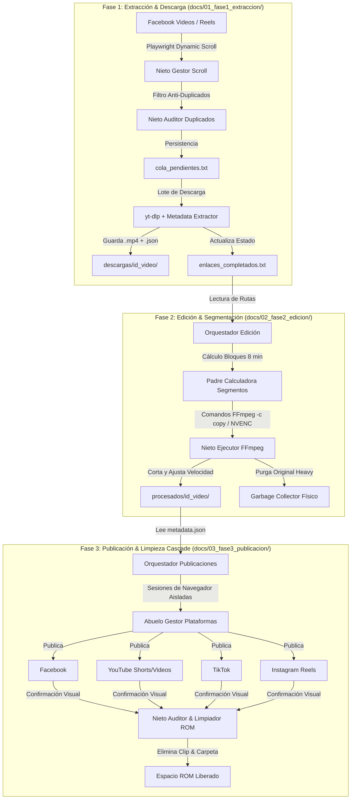

# Arquitectura General del Sistema FaceDPeli

## 1. Visión Holística y Principios de Diseño
El sistema **FaceDPeli** es una plataforma automatizada de extremo a extremo diseñada para la extracción, procesamiento/edición y redistribución multicanal de contenido audiovisual en formato de video corto y clips segmentados.

El sistema sigue cuatro principios fundamentales de diseño:
1. **Regla de Responsabilidad Única y Modularidad Escala Corta**: Ningún archivo fuente en Python superará las **300 líneas de código**. La jerarquía de llamados sigue una estructura taxonómica clara: `orquestador` -> `abuelo` -> `padre` -> `hijo` -> `nieto`.
2. **Consumo de Memoria Estático (Estrategia Zero-RAM Cache)**: Ninguna colección transaccional (enlaces, logs de error, estados) se mantiene en memoria RAM. Todo el control de estado se gestiona en tiempo real mediante archivos de texto plano (`.txt`) append-only en el disco (ROM).
3. **Procesamiento Directo en Rom/GPU**: Las operaciones pesadas de video (decodificación, corte, escalado de velocidad) se delegan 100% a binarios nativos de bajo nivel (`FFmpeg`, `yt-dlp`) aprovechando aceleración por hardware (`NVENC` / `QSV`).
4. **Resiliencia y Persistencia Transaccional**: Cada fase es independiente y desacoplada. Si el sistema se interrumpe (corte eléctrico, caída de red, reinicio), al volver a ejecutar retoma exactamente en el último estado no completado.

---

## 2. Diagrama Macro del Flujo de Datos



---

## 3. Estructura de Directorios del Proyecto y Documentación

```
facedpeli/
├── config/
│   ├── parametros_globales.json
│   └── cookies_facebook.json
├── datos_persistencia/
│   ├── historial_global_enlaces.txt
│   ├── cola_pendientes.txt
│   ├── enlaces_completados.txt
│   ├── registro_errores.txt
│   └── estado_publicaciones.txt
├── descargas/
│   └── [id_video]/
│       ├── video_original.mp4
│       └── metadata.json
├── procesados/
│   └── [id_video]/
│       ├── clip_parte_1.mp4
│       ├── clip_parte_2.mp4
│       └── metadata_segmentada.json
├── docs/
│   ├── 00_general/
│   │   └── arquitectura_general.md
│   ├── 01_fase1_extraccion/
│   │   ├── 01_especificacion_tecnica.md
│   │   ├── 02_pasos_desarrollo_y_algoritmos.md
│   │   ├── 03_optimizaciones_y_resiliencia.md
│   │   └── 04_integracion_tecnologica.md
│   ├── 02_fase2_edicion/
│   │   └── arquitectura_fase2_edicion.md
│   └── 03_fase3_publicacion/
│       └── arquitectura_fase3_publicacion.md
├── fase1_extraccion/
│   ├── orquestador_descargas_principal.py
│   ├── padre_control_de_estados_txt.py
│   ├── nieto_gestor_scroll_dinamico.py
│   └── nieto_auditor_de_duplicados.py
├── fase2_edicion/
│   ├── orquestador_edicion_principal.py
│   ├── abuelo_gestor_de_carpetas_por_video.py
│   ├── padre_calculadora_de_segmentos.py
│   ├── hijo_procesador_de_velocidad.py
│   └── nieto_ejecutor_ffmpeg_optimizado.py
├── fase3_publicacion/
│   ├── orquestador_publicaciones_principal.py
│   ├── abuelo_gestor_plataformas_multiplex.py
│   ├── padre_publicador_tiktok.py
│   ├── padre_publicador_youtube.py
│   ├── padre_publicador_facebook.py
│   ├── padre_publicador_instagram.py
│   ├── hijo_inyector_de_metadatos_y_carga.py
│   └── nieto_auditor_y_limpiador_rom.py
└── instruccionesiniciales.md
```

---

## 4. Matriz de Convención de Nombres y Jerarquía de Clases/Módulos

| Nivel Jerárquico | Prefijo del Nombre | Responsabilidad Principal | Regla de Código |
| :--- | :--- | :--- | :--- |
| **Orquestador** | `orquestador_*.py` | Punto de entrada del pipeline, coordinación general y bucle principal. | Max 300 líneas, sin lógica interna pesada. |
| **Abuelo** | `abuelo_*.py` | Gestión de estructura de archivos, carpetas e instancias complejas (multiplex). | Max 300 líneas. |
| **Padre** | `padre_*.py` | Lógica de negocio específica (cálculo de segmentos, control de archivos de estado). | Max 300 líneas. |
| **Hijo** | `hijo_*.py` | Modificación de parámetros de comandos o inyección de metadatos. | Max 300 líneas. |
| **Nieto** | `nieto_*.py` | Ejecutores de bajo nivel (llamadas a FFmpeg, auditores de disco, scrolls de DOM). | Max 300 líneas. |

---

## 5. Política Global de Manejo de Errores
- **No Inserción Silenciosa**: Cualquier fallo en scrapers, llamadas de FFmpeg o publicaciones web escribe inmediatamente una línea formateada en `registro_errores.txt` con la estructura: `[YYYY-MM-DD HH:MM:SS] | Módulo | ID_Recurso | ErrorDetail`.
- **Reintento Exponencial Ligero**: En interrupciones de red durante la descarga o carga web, el módulo correspondiente realizará máximo 3 reintentos antes de marcar el elemento como erróneo en disco y continuar con la cola.
- **Rollback y Retención de Archivos**: Un archivo nunca se borra de la ROM hasta que el `nieto_auditor_y_limpiador_rom.py` obtenga una confirmación 200/Visual OK de todas las redes destino solicitadas.
