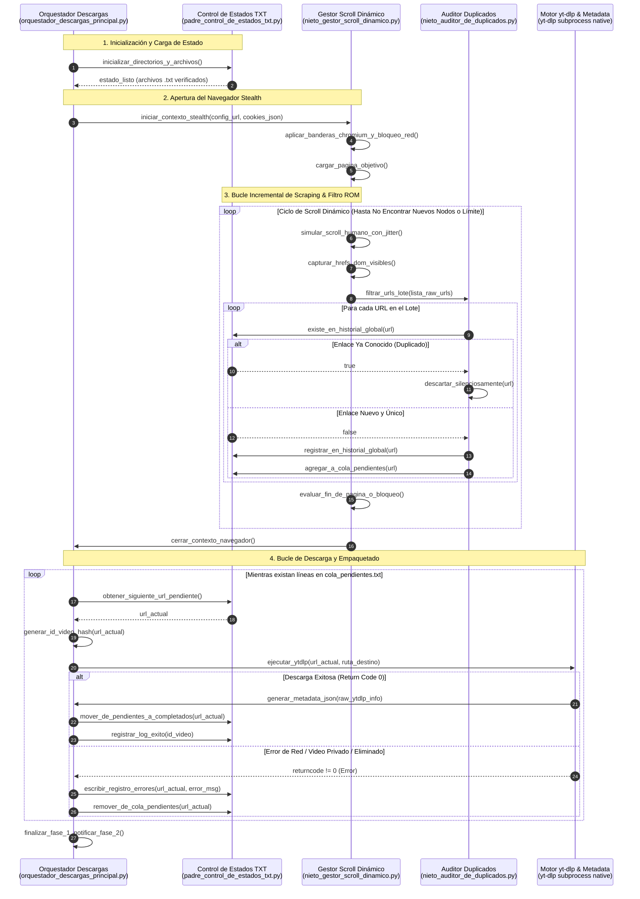

# Especificación Técnica de Arquitectura - Fase 1: Extracción & Descarga

## 1. Visión General del Componente
La **Fase 1 (Extracción & Descarga)** es la puerta de entrada de la tubería de procesamiento de FaceDPeli. Su objetivo primario es descubrir, auditar, almacenar y descargar videos y reels de fuentes objetivo (como Facebook) en su máxima calidad audiovisual disponible (contenedor MP4, códec de video H.264, audio AAC), abstrayendo al usuario de desbordamientos de memoria RAM, detecciones anti-bot y cuellos de botella por descargas duplicadas.

### Principios Operativos de la Fase 1
- **Cero Persistencia de Estado en RAM**: Cada enlace detectado se consulta y escribe directamente en el disco duro (archivos `.txt` append-only).
- **Stealth & Emulación Humana**: El raspado visual se ejecuta en un entorno aislado de Playwright con cookies de sesión inyectadas y emulación de patrones de scroll aleatorios.
- **Intercepción Agresiva de Recursos Web**: Se bloquea el tráfico de imágenes, fuentes tipográficas, hojas de estilo CSS y llamadas analíticas para reducir el consumo de CPU y ancho de banda en un **80%**.
- **Contrato de Salida Inmutable**: Cada descarga exitosa entrega un directorio único en `descargas/[id_video]/` conteniendo `video_original.mp4` y `metadata.json`.

---

## 2. Diagrama de Secuencia End-to-End Ampliado



---

## 3. Contratos de Datos y Esquemas JSON

### 3.1 Esquema de Metadatos por Video (`descargas/[id_video]/metadata.json`)
Cada video descargado exitosamente debe ir acompañado de su archivo de metadatos estandarizado con la siguiente estructura estricta:

```json
{
  "$schema": "http://json-schema.org/draft-07/schema#",
  "title": "VideoMetadataFase1",
  "type": "object",
  "properties": {
    "id_video": {
      "type": "string",
      "description": "ID único extraído o generado mediante MD5 Hash de la URL original."
    },
    "url_original": {
      "type": "string",
      "format": "uri",
      "description": "URL canónica de la publicación fuente en Facebook."
    },
    "titulo_original": {
      "type": "string",
      "description": "Título o primera línea del texto del post original limpiado de emojis excesivos."
    },
    "descripcion_original": {
      "type": "string",
      "description": "Texto completo del post original extraído por scraping/yt-dlp."
    },
    "fecha_extraccion": {
      "type": "string",
      "format": "date-time",
      "description": "Estampa de tiempo ISO 8601 del momento exacto de finalización de descarga."
    },
    "duracion_segundos": {
      "type": "number",
      "description": "Duración total del archivo de video en segundos."
    },
    "resolucion": {
      "type": "string",
      "example": "1080x1920",
      "description": "Dimensiones del video descargado (Ancho x Alto)."
    },
    "formato": {
      "type": "string",
      "enum": ["mp4"],
      "default": "mp4"
    },
    "codec_video": {
      "type": "string",
      "enum": ["h264"],
      "default": "h264"
    },
    "codec_audio": {
      "type": "string",
      "enum": ["aac"],
      "default": "aac"
    },
    "tamanio_bytes": {
      "type": "integer",
      "description": "Tamaño físico del archivo MP4 en disco."
    }
  },
  "required": [
    "id_video",
    "url_original",
    "titulo_original",
    "descripcion_original",
    "fecha_extraccion",
    "duracion_segundos",
    "formato",
    "codec_video",
    "codec_audio"
  ]
}
```

---

## 4. Matriz de Archivos de Persistencia en Disco (`datos_persistencia/`)

| Archivo TXT | Modo de E/S | Estructura por Línea | Propósito Operativo |
| :--- | :--- | :--- | :--- |
| `historial_global_enlaces.txt` | Append-Only (`a+`) | `https://facebook.com/watch?v=1234` | Registro histórico acumulativo anti-duplicados. Nunca se limpia ni borra. |
| `cola_pendientes.txt` | Lectura/Escritura (`r+`) | `https://facebook.com/watch?v=5678` | Lista FIFO de tareas pendientes. Al completar o fallar un ítem, la línea se elimina. |
| `enlaces_completados.txt` | Append-Only (`a+`) | `ID_VIDEO \| URL \| YYYY-MM-DD HH:MM:SS` | Registro de videos descargados con éxito listos para la Fase 2 (Edición). |
| `registro_errores.txt` | Append-Only (`a+`) | `[YYYY-MM-DD HH:MM:SS] \| FASE1 \| URL \| ERROR_CODE \| DETALLE` | Log auditado de descargas fallidas o enlaces inaccesibles. |
