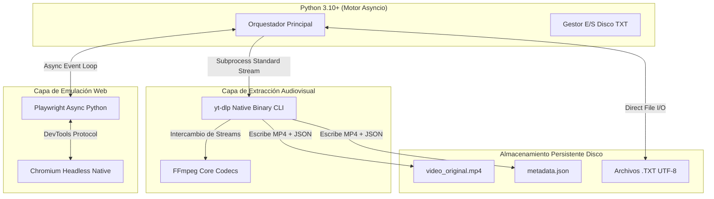

# Adaptación e Integración Tecnológica - Fase 1

Este documento analiza la arquitectura de integración, acoplamiento ligero y protocolos de comunicación inter-tecnológica entre las distintas bibliotecas, binarios nativos y formatos de persistencia de la **Fase 1**.

---

## 1. Stack Tecnológico de la Fase 1



---

## 2. Matriz de Componentes Tecnológicos

| Tecnología / Binario | Versión / Tipo | Rol Específico | Mecanismo de Adaptación |
| :--- | :--- | :--- | :--- |
| **Python** | 3.10+ (Standard Library) | Coordinador general, gestión de eventos asíncronos y reglas de negocio. | `asyncio`, `subprocess`, `urllib.parse`, `json`. |
| **Playwright Python** | 1.40+ (Async API) | Control del navegador Chromium, emulación de scrolls, inyección de cookies. | Protocolo Chrome DevTools (CDP) mediante bindings asíncronos en Python. |
| **yt-dlp** | Standalone Binary / CLI | Decodificación de flujos HLS/DASH de Facebook, desacoplamiento de MP4 y metadatos. | Invocación mediante `subprocess.Popen` / `subprocess.run` en Python con captura de salida estándar. |
| **FFmpeg** | Binary OS (NVENC/QSV) | Utilizado internamente por `yt-dlp` para remuxing o fusión de video/audio sin recodificar. | Argumento `--ffmpeg-location` redirigido al binario del sistema. |
| **Archivos TXT (ROM)** | Plain Text UTF-8 | Base de datos liviana, persistente y atómica. | Operaciones con `open(file, mode, encoding='utf-8')` y bloqueos de archivo si es necesario. |

---

## 3. Interfaces de Comunicación e Intercambio de Datos

### 3.1 Interfaz Python <-> Playwright (Async Context Manager)
La integración con Playwright no utiliza hilos síncronos pesados. Se integra al bucle de eventos nativo de Python (`asyncio`):

```python
async with async_playwright() as p:
    browser = await p.chromium.launch(headless=True, args=CHROMIUM_FLAGS)
    context = await browser.new_context(viewport={'width': 1280, 'height': 720})
    await context.add_cookies(cookies_cargadas)
    page = await context.new_page()
    # Flujo de scraping...
```

### 3.2 Interfaz Python <-> `yt-dlp` (Subprocess CLI Wrapper)
Para aislar la memoria de Python y evitar fugas de memoria al descargar archivos grandes de video, Python llama a `yt-dlp` como un proceso hijo independiente del SO:

```python
import subprocess
import json

def descargar_con_ytdlp(url: str, destino_folder: str) -> dict:
    cmd = [
        "yt-dlp",
        "--skip-download",
        "--dump-json",
        url
    ]
    resultado = subprocess.run(cmd, capture_output=True, text=True, check=True)
    metadata_raw = json.loads(resultado.stdout)
    return metadata_raw
```

### 3.3 Adaptación Multiplataforma (Windows OS / Encoding)
Dado que el entorno del usuario es **Windows**, se aplican las siguientes reglas de adaptación tecnológica:
- **Rutas de Archivos**: Se utiliza la librería `pathlib.Path` de Python para garantizar compatibilidad con barras diagonales inversas (`\`) de Windows y evitar errores de ruta.
- **Codificación de Archivos**: Todos los archivos de texto (`.txt`, `.json`) se fuerzan explícitamente con `encoding='utf-8'` para evitar errores por páginas de códigos predeterminadas de Windows (como `cp1252`).
- **Llamadas a CLI**: Las ejecuciones de comandos en PowerShell/CMD especifican `shell=False` en `subprocess` para evitar vulnerabilidades de inyección de comandos y sobrecarga de procesos de consola.

---

## 4. Pruebas de Integración y Adaptabilidad

Para validar la armonía entre componentes tecnológicos:
1. **Prueba de Rendimiento Inter-Proceso**: Confirmar que la apertura y cierre de subprocess de `yt-dlp` no deje procesos huérfanos (`zombie processes`) en el Administrador de Tareas de Windows.
2. **Prueba de Decodificación UTF-8**: Verificar que títulos con caracteres especiales (emojis, acentos, símbolos) se guarden correctamente en `metadata.json` sin corrupción `unicodeescape`.
