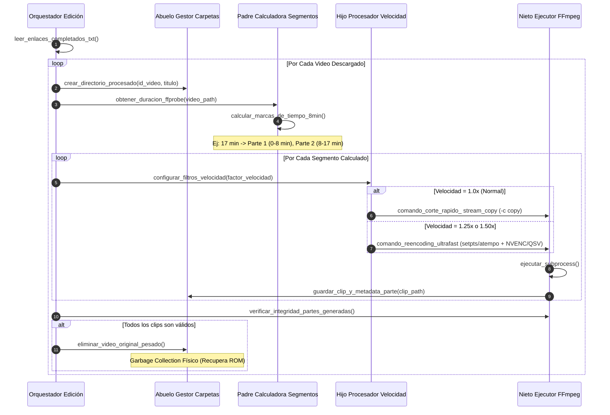

# Especificación de Arquitectura - Fase 2: Edición y Procesamiento de Video (FFmpeg Processing Engine)

## 1. Propósito y Alcance
La Fase 2 lee los videos completados de la Fase 1, calcula los puntos de corte en bloques de exactamente **8 minutos**, ajusta la velocidad de reproducción según la configuración deseada (1.0x, 1.25x, 1.50x), empaqueta las partes resultantes en carpetas aisladas por video con sus metadatos actualizados, y purga físicamente el video original pesado para maximizar la capacidad de disco duro.

---

## 2. Diagrama de Secuencia de la Fase 2

---

## 3. Desglose Detallado de Módulos (Máximo 300 Líneas)

### 3.1 `fase2_edicion/orquestador_edicion_principal.py`
- **Función**: Punto de entrada de la Fase 2. Monitorea la disponibilidad de videos descargados en la Fase 1 y coordina el pipeline de edición.
- **Entradas**: `descargas/[id_video]/video_original.mp4`, `descargas/[id_video]/metadata.json`.
- **Salidas**: Traspaso de carpetas a `procesados/[id_video]/`.

### 3.2 `fase2_edicion/abuelo_gestor_de_carpetas_por_video.py`
- **Función**: Encargado de la creación de la taxonomía de carpetas por video y gestión de archivos individuales de metadatos segmentados (`metadata_segmentada.json`).
- **Métodos Clave**: `crear_carpeta_video()`, `renombrar_con_nomenclatura_parte()`, `eliminar_archivo_pesado_original()`.

### 3.3 `fase2_edicion/padre_calculadora_de_segmentos.py`
- **Función**: Ejecuta `ffprobe` vía subprocess para consultar la duración exacta en segundos del video original sin cargar píxeles en memoria RAM.
- **Regla de Negocio de Cortes**:
  - Duración del bloque estándar: 480 segundos (8 minutos).
  - Si el remanente final es menor a 60 segundos, se adhiere al segmento anterior para evitar clips ultra-cortos de baja relevancia.
- **Métodos Clave**: `obtener_duracion_exacta()`, `generar_rangos_corte()`.

### 3.4 `fase2_edicion/hijo_procesador_de_velocidad.py`
- **Función**: Construye la cadena de argumentos y filtros de FFmpeg en función del factor de velocidad seleccionado:
  - **1.0x**: Retorna flag `-c copy` (0% uso de CPU/RAM, corte en 1 segundo).
  - **1.25x**: Añade `-vf setpts=0.8*PTS -af atempo=1.25`.
  - **1.50x**: Añade `-vf setpts=0.6666666666666666*PTS -af atempo=1.5`.
- **Métodos Clave**: `obtener_flags_ffmpeg()`.

### 3.5 `fase2_edicion/nieto_ejecutor_ffmpeg_optimizado.py`
- **Función**: Ejecuta el binario de FFmpeg nativo del sistema operativo mediante `subprocess.Popen` redireccionando los logs de salida.
- **Optimizaciones de Rendimiento**:
  - Detección e inclusión automática de encoders por hardware: `h264_nvenc` (NVIDIA) o `h264_qsv` (Intel).
  - Configuración de preset `ultrafast` para re-codificaciones.
  - Límite explícito de hilos (`-threads 4`) para evitar cuelgues del SO.
- **Métodos Clave**: `ejecutar_corte_ffmpeg()`, `validar_duracion_clip_resultante()`.
