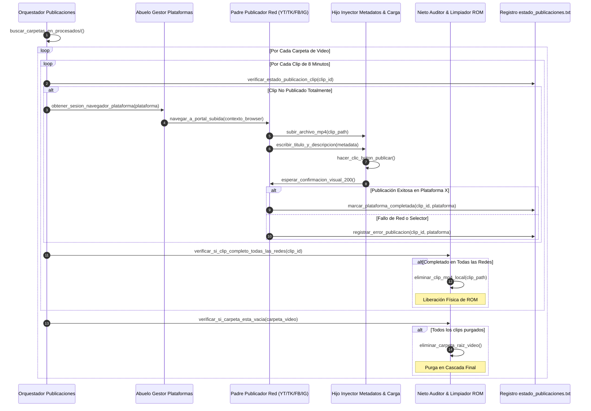

# Especificación de Arquitectura - Fase 3: Distribución, Publicación y Limpieza Cascade (Multi-Platform Auto-Publisher)

## 1. Propósito y Alcance
La Fase 3 se encarga de tomar los clips de 8 minutos procesados en la Fase 2, leer sus metadatos asociados (título original + sufijo de parte + descripción), cargarlos de forma automatizada mediante Playwright en las redes sociales seleccionadas (Facebook, YouTube, TikTok, Instagram), monitorear la confirmación exitosa de cada plataforma y ejecutar una purga física en cascada que elimine los clips locales y sus carpetas contenedoras para recuperar el 100% del espacio en disco.

---

## 2. Diagrama de Secuencia de la Fase 3

---

## 3. Desglose Detallado de Módulos (Máximo 300 Líneas)

### 3.1 `fase3_publicacion/orquestador_publicaciones_principal.py`
- **Función**: Punto de entrada de la Fase 3. Escanea las carpetas de `procesados/`, verifica contra `estado_publicaciones.txt` y orquesta la distribución multicanal.
- **Entradas**: Clips mp4 y metadatos en `procesados/[id_video]/`.
- **Salidas**: Publicación en redes sociales y purga total de datos procesados.

### 3.2 `fase3_publicacion/abuelo_gestor_plataformas_multiplex.py`
- **Función**: Administra sesiones de navegador aisladas e independientes (Browser Contexts en Playwright) para evitar contaminación cruzada de cookies entre TikTok, YouTube, Facebook e Instagram.
- **Métodos Clave**: `obtener_contexto_youtube()`, `obtener_contexto_tiktok()`, `obtener_contexto_facebook()`, `obtener_contexto_instagram()`.

### 3.3 `fase3_publicacion/padre_publicador_tiktok.py` (y Homólogos: YouTube, Facebook, Instagram)
- **Función**: Contiene las rutas y flujos de trabajo específicos del portal Creator Studio / Studio de subida de cada plataforma.
- **Resiliencia**: Utiliza selectores orientados a accesibilidad (ARIA roles, labels) y XPath relativos para evitar rompimientos causados por clases CSS dinámicas de los portales web.
- **Métodos Clave**: `iniciar_flujo_subida()`, `validar_estado_procesamiento_plataforma()`.

### 3.4 `fase3_publicacion/hijo_inyector_de_metadatos_y_carga.py`
- **Función**: Setea los campos del formulario de publicación:
  - Título: `[Título Original Clean] - Parte [X]`
  - Descripción: `[Descripción Original] #resumen #pelicula #parteX`
  - Inyección de archivo mediante eventos de drop o `set_input_files`.
- **Métodos Clave**: `inyectar_archivo_mp4()`, `completar_formulario_metadatos()`.

### 3.5 `fase3_publicacion/nieto_auditor_y_limpiador_rom.py`
- **Función**: Encargado de la purga física y segura del almacenamiento ROM.
- **Regla Estricta de Borrado**:
  - **No Borrado Prematuro**: Un clip solo se borra si `estado_publicaciones.txt` confirma éxito en el 100% de las plataformas configuradas (ej. `[clip_1.mp4] -> FB:OK, YT:OK, TK:OK, IG:OK`).
  - **Purga en Cascada**: Borra `clip_parte_X.mp4`, luego `metadata_segmentada.json`, y finalmente la carpeta `procesados/[id_video]/`.
- **Métodos Clave**: `validar_requisitos_borrado()`, `ejecutar_eliminacion_cascada()`.
