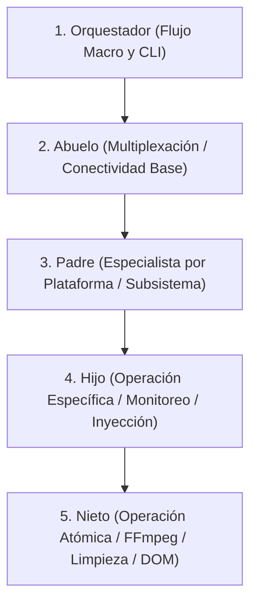

# Estándar de Código, Arquitectura y Buenas Prácticas — Sistema Ragnarok

> **Regla de Documentación**: Esta guía define las directrices obligatorias para el desarrollo, refactorización y extensión de cualquier módulo dentro del repositorio **Ragnarok**. Ninguna modificación debe violar estas directrices.

---

## 1. Regla de Oro: Cero Emojis (0 Emojis)

El sistema **Ragnarok** tiene una política estricta de **cero emojis** en todos los niveles del proyecto:

### 1.1 Justificación Técnica
1. **Incompatibilidad de Consola Windows**: En sistemas operativos Windows con codificaciones por defecto como `cp1252` o buffers de terminal estándar, los caracteres Unicode de 4 bytes (como `🚀`, `✅`, `🖥️`, `👁️‍🗨️`) disparan excepciones fatales:
   ```text
   UnicodeEncodeError: 'charmap' codec can't encode character ...: character maps to <undefined>
   ```
   Esto puede quebrar subprocesos en segundo plano silenciosamente o detener tareas críticas.
2. **Estética Profesional**: Los emojis proporcionan una apariencia infantil y genérica. Ragnarok utiliza un diseño sobrio, tecnológico y profesional (tema Obsidian Dark).

### 1.2 Dónde Aplica la Prohibición (100% del Código)
- **Consola Python**: `print()` debe utilizar prefijos textuales limpios como `[INFO]`, `[OK]`, `[ERROR]`, `[WARN]`, `[TELEGRAM]`, `[MAIN]`.
- **Logs del Servidor**: Funciones como `escribir_log()` deben emitir niveles legibles (`INFO`, `OK`, `ERROR`, `WARN`).
- **Nombres de Variables y Rutas**: Prohibido el uso de caracteres extendidos o emojis.
- **Frontend (HTML/JS)**:
  - En botones, tarjetas, encabezados y menús: **usar exclusivamente íconos SVG vectoriales** ubicados en `interfaz/iconos/`.
  - En etiquetas de formularios y elementos `<select>` / `<option>`: **usar texto descriptivo limpio**, sin emojis intercalados.

---

## 2. Responsabilidad Única (SRP) y Límite Estricto de Líneas (< 300 LOC)

### 2.1 Límite Absoluto de 300 Líneas de Código (LOC)
- **Ningún archivo `.py` superará las 300 líneas de código**.
- Si un archivo alcanza entre 250 y 280 líneas, debe ser evaluado y refactorizado extrayendo sub-responsabilidades a nuevos módulos hijos o utilitarios.
- Archivos `.js` y `.html` deben modularizarse en la medida de lo posible para evitar archivos monolíticos inmanejables.

### 2.2 Principio de Responsabilidad Única (Single Responsibility Principle)
- Cada módulo, clase y función debe tener **una sola razón para cambiar**.
- **Prohibido el patrón "God Object" (Clase Dios)**:
  - Un publicador no debe procesar video con FFmpeg.
  - Una ruta Flask no debe contener la lógica Playwright directamente; solo valida el request HTTP y orquesta o lanza el subproceso correspondiente.
  - Un monitor de DOM no debe inicializar sesiones de navegador; solo inspecciona elementos del DOM y emite estados o porcentajes.

---

## 3. Arquitectura Taxonómica Jerárquica (Anti-Espagueti)

El backend de Ragnarok sigue una taxonomía genealógica estricta que define el nivel de abstracción y alcance de cada componente:



### 3.1 Definición de Niveles
1. **Orquestadores (`orquestador_*.py`)**:
   - Coordinan la secuencia lógica de una fase completa o de un flujo individual bajo demanda.
   - Gestionan argumentos de línea de comandos (`argparse`), lectura de configuraciones globales y control de códigos de retorno (`sys.exit`).
2. **Abuelos (`abuelo_*.py`)**:
   - Abstraen recursos compartidos, navegadores Playwright multiplexados o ciclos de concurrencia.
3. **Padres (`padre_*.py`)**:
   - Representan la implementación de una plataforma o entidad completa (ej: `padre_publicador_telegram.py`, `padre_publicador_youtube.py`).
4. **Hijos (`hijo_*.py`)**:
   - Manejan tareas delegadas complejas (ej: `hijo_inyector_de_metadatos_y_carga.py`, `hijo_monitor_transferencia_telegram.py`).
5. **Nietos (`nieto_*.py`)**:
   - Ejecutores atómicos de máxima especialización (ej: `nieto_ejecutor_ffmpeg_optimizado.py`, `nieto_auditor_y_limpiador_rom.py`).

### 3.2 Reglas de Dependencia y Acoplamiento
- **Flujo Unidireccional**: Las dependencias van de arriba hacia abajo (Orquestador -> Abuelo -> Padre -> Hijo -> Nieto).
- **Prohibidas Dependencias Circulares**: Un nieto o hijo **nunca** debe importar a su padre ni al orquestador.
- **Inyección de Dependencias**: Los parámetros de configuración o instancias de Playwright (`page`, `browser`) se transfieren como argumentos de función o constructor, evitando variables globales compartidas.

---

## 4. UI y Frontend: Estándar SVG First y Tema Obsidian

### 4.1 Íconos Vectoriales en `interfaz/iconos/`
- Toda acción, botón, menú o indicativo visual debe usar un archivo `.svg` ubicado en `interfaz/iconos/`.
- Los SVGs deben ser ultra livianos (menos de 2 KB cada uno).
- Clases CSS estándar para íconos:
  - `.icono-svg-sm`: 14x14 px (para botones pequeños, chips o tablas).
  - `.icono-svg`: 18x18 px (para barras de herramientas y menús).
  - `.icono-svg-lg`: 24x24 px (para encabezados de secciones y métricas destacadas).

### 4.2 Paleta de Color Obsidian Dark
- Evitar colores fluorescentes o degradados genéricos de IA (morado/azul brillante sin balance).
- Emplear variables CSS del sistema:
  - `--bg0` (#090b10), `--bg1` (#0e121a), `--bg2` (#141923), `--bg3` (#1a2130).
  - `--cyan` (#00c8f8) para acentos primarios e interactividad.
  - `--border` (rgba(255,255,255,0.07)) para separadores discretos.
  - `--txt1` (#e6edf3), `--txt2` (#8b949e), `--txt3` (#545d68).

---

## 5. Eficiencia, Rendimiento y Hardware de Bajos Recursos

Ragnarok está diseñado para operar de forma eficiente incluso en máquinas de especificaciones limitadas:

1. **Modo Invisible (Headless) por Defecto o Elección**:
   - Los módulos Playwright deben soportar `--headless` y `--visible`.
   - En modo headless, configurar siempre un viewport desktop válido (`viewport={"width": 1440, "height": 900}`) para evitar layouts comprimidos o fallos de renderizado en Single Page Apps (SPA).
2. **Estrategia Zero-RAM Cache**:
   - No almacenar colas masivas de videos en variables globales de memoria RAM.
   - La persistencia se realiza append-only en archivos planos en disco (`datos_persistencia/*.txt` y `config/*.json`).
3. **Optimización con FFmpeg**:
   - Priorizar `-c copy` (stream copy sin reencodeo) siempre que las dimensiones y codecs del contenedor lo permitan.
   - Detectar aceleradores por hardware (`NVENC`, `QSV`) y contar con fallback seguro a CPU (`libx264 -preset veryfast`).
4. **Subprocesos Desacoplados**:
   - El servidor Flask nunca debe ejecutar tareas pesadas de Playwright o FFmpeg de forma síncrona dentro del hilo de la solicitud HTTP. Debe delegarlas a `subprocess.Popen` y responder de inmediato al cliente.

---

## 6. Integridad de Directorios y Preservación

1. **Directorio `docs/analisis/`**:
   - **Bajo ninguna circunstancia se debe editar, mover o eliminar ningún archivo dentro de `docs/analisis/`**. Es un registro histórico inmutable.
2. **Suite de Pruebas**:
   - Toda nueva funcionalidad debe contar o integrarse con pruebas unitarias en `pruebas/prueba_*.py`.
   - Las pruebas deben ejecutarse sin dependencias de red externa mediante mocks (`unittest.mock`).
3. **Manejo de Rutas Multiplataforma**:
   - Usar siempre `pathlib.Path` en lugar de concatenaciones de strings con `/` o `\\`.
